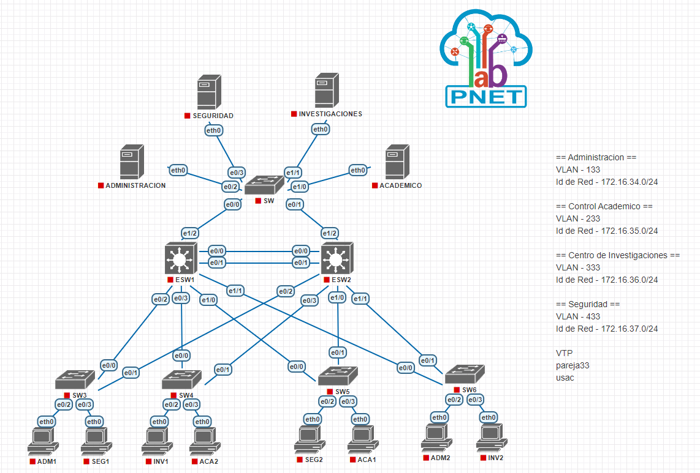
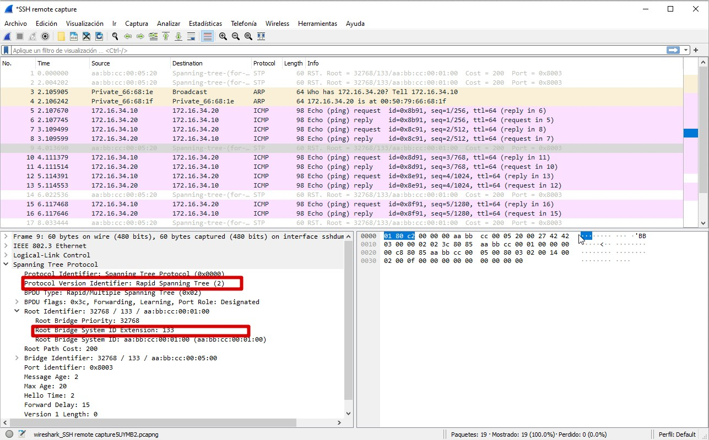
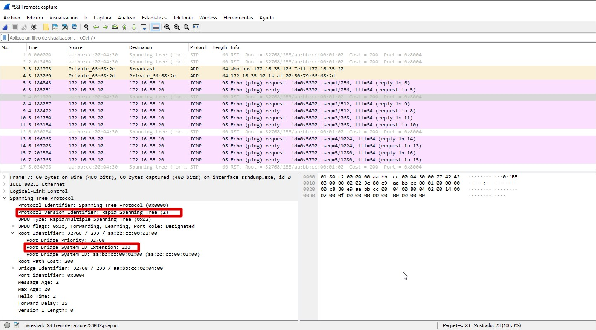
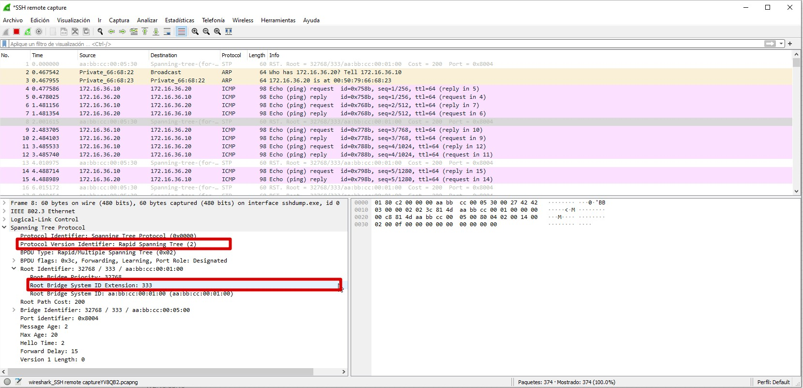
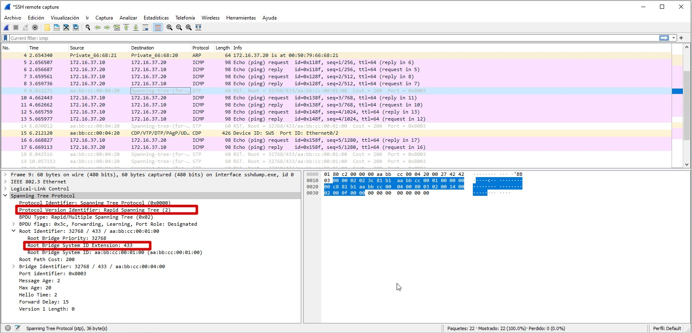

#### MANUAL TECNICO - PROYECTO1 1

#### 1 - Tabla Direcciones IP

| Nombre Dispositivo | Area | Direccion IP | Mascara SubRed (CIDR) | Puerta de Enlace Predeterminada | VLAN |
|-----|---|---|---|---|---|
|ADMINISTRACION|Administracion|172.16.34.2|/24|172.16.34.1|133|
|ADM1|Administracion|172.16.34.10|/24|172.16.34.1|133|
|ADM2|Administracion|172.16.34.20|/24|172.16.34.1|133|
|---|---|---|---|---|---|
|ACADEMICO|Control Academico|172.16.35.2|/24|172.16.35.1|233|
|ACA1|Control Academico|172.16.35.10|/24|172.16.35.1|233|
|ACA2|Control Academico|172.16.35.20|/24|172.16.35.1|233|
|---|---|---|---|---|---|
|INVESTIGACIONES|Centro de Investigaciones|172.16.36.2|/24|172.16.36.1|333|
|INV1|Centro de Investigaciones|172.16.36.10|/24|172.16.36.1|333|
|INV2|Centro de Investigaciones|172.16.36.20|/24|172.16.36.1|333|
|---|---|---|---|---|---|
|SEGURIDAD|Seguridad|172.16.37.2|/24|172.16.37.1|433|
|SEG1|Seguridad|172.16.37.10|/24|172.16.37.1|433|
|SEG2|Seguridad|172.16.37.20|/24|172.16.37.1|433|

#### 2 - Topologia Implementada

  

#

#### 3 - Detalle Comandos Utilizados
#

##### - ESW1

    ! Modo Configuracion
    enable
    configure terminal

    ! hostname
    hostname ESW1

    ! Creacion VLANS
    vlan 133
    name Administracion
    vlan 233
    name Control Academico
    vlan 333
    name Investigaciones
    vlan 433
    name Seguridad
    vlan 99
    name Nativa
    vlan 999
    name Blackhole

    ! Configuracion VTP
    vtp version 2
    vtp mode server
    vtp domain pareja33
    vtp password usac

    ! Configuraciones puertos en modo troncal y VLAN nativa
    interface range Ethernet 0/0-3
    switchport trunk encapsulation dot1q
    switchport mode trunk
    switchport trunk native vlan 99
    switchport trunk allowed vlan 133,233,333,433,99,1002-1005

    interface range Ethernet 1/0-2
    switchport trunk encapsulation dot1q
    switchport mode trunk
    switchport trunk native vlan 99
    switchport trunk allowed vlan 133,233,333,433,99,1002-1005

    ! Puerto sin utilizar
    interface e1/3
    switchport mode access
    switchport access vlan 999

    ! STP rapid RAIZ
    configure terminal
    spanning-tree mode rapid-pvst
    spanning-tree vlan 99,133,233,333,433,1002-1005 root primary
    
    ! Save
    end
    write

#

##### - SW5

    ! Modo Configuracion
    enable
    configure terminal

    ! hostname
    hostname SW5

    ! Configuracion VTP
    vtp version 2
    vtp mode client
    vtp domain pareja33
    vtp password usac

    ! Configuraciones puertos en modo troncal y VLAN nativa
    interface range Ethernet 0/0-1
    switchport trunk encapsulation dot1q
    switchport mode trunk
    switchport trunk native vlan 99
    switchport trunk allowed vlan 133,233,333,433,99,1002-1005

    ! Configuracion primer acceso VLAN
    interface e0/2
    switchport mode access
    switchport access vlan 433

    ! Configuracion segundo acceso VLAN
    interface e0/3
    switchport mode access
    switchport access vlan 233

    ! STP rapid
    configure terminal
    spanning-tree mode rapid-pvst
    spanning-tree vlan 99,133,233,333,433,1002-1005

    ! Save
    end
    write

#

##### - SW

    ! Modo Configuracion
    enable
    configure terminal

    ! hostname
    hostname SW

    ! Configuracion VTP
    vtp version 2
    vtp mode client
    vtp domain pareja33
    vtp password usac

    ! Configuraciones puertos en modo troncal y VLAN nativa
    interface range Ethernet 0/0-1
    switchport trunk encapsulation dot1q
    switchport mode trunk
    switchport trunk native vlan 99
    switchport trunk allowed vlan 133,233,333,433,99,1002-1005

    ! Configuracion primer Server
    interface e0/2
    switchport mode access
    switchport access vlan 133

    ! Configuracion segundo Server
    interface e0/3
    switchport mode access
    switchport access vlan 433

    ! Configuracion tercer Server
    interface e1/0
    switchport mode access
    switchport access vlan 233

    ! Configuracion cuarto Server
    interface e1/1
    switchport mode access
    switchport access vlan 333

    ! Puerto sin utilizar
    interface range Ethernet 1/2-3
    switchport mode access
    switchport access vlan 999

    ! STP rapid
    configure terminal
    spanning-tree mode rapid-pvst
    spanning-tree vlan 99,133,233,333,433,1002-1005

    ! Save
    end
    write

#

##### 4 -  Capturas Wireshark
#

##### - Administracion VLAN 133

  

##### - Control académico VLAN 233

 

##### - Centro de ingestigaciones VLAN 333

 

##### - Seguridad VLAN 433

 
