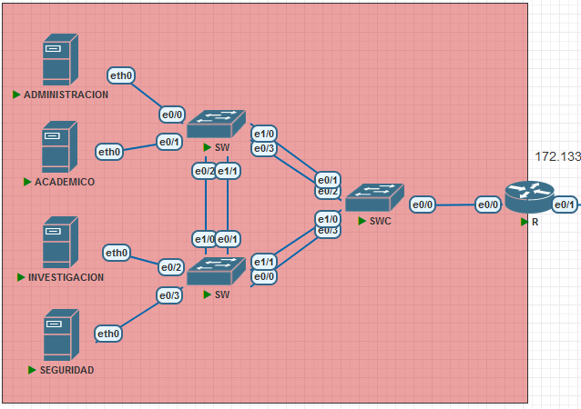
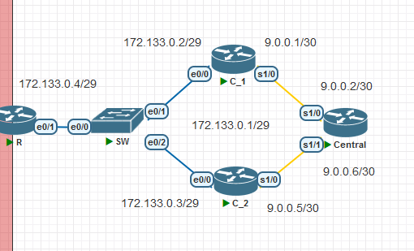

#### MANUAL TECNICO - PROYECTO 2

#### 1 - Tabla Direcciones IP

| Dispositivo | Interfaz | IP | Mascara SubRed (CIDR) | Puerta de Enlace Predeterminada
|---|---|---|---|---|
|Academico|eth0|172.133.2.2|/27|172.133.2.3
|Investigacion|eth0|172.133.2.33|/28|172.133.2.34
|Administracion|eth0|172.133.2.49|/28|172.133.2.50
|Seguridad|eth0|172.133.2.65|/29|172.133.2.66
|R|e0/0.13|172.133.2.3|/27|
|R|e0/0.23|172.133.2.34|/28|
|R|e0/0.33|172.133.2.50|/28|
|R|e0/0.43|172.133.2.66|/29|
|R|e0/1|172.133.0.4|/29|
|C_1|e0/0|172.133.0.2|/29|
|C_2|e0/0|172.133.0.3|/29|
|C_1 - C_2|Virtual|172.133.0.1|/29|
|C_1|s1/0|9.0.0.1|/30|
|C_2|s1/0|9.0.0.5|/30|
|Central|s1/0|9.0.0.2|/30|
|Central|s1/1|9.0.0.6|/30|

#

#### 2 - Tabla de Redes

| ID de Red | Direcciones IP Disponibles | Mascara de SubRed | Primera IP Disponible | Ultima IP Disponible | Direccion de Broadcast |
|---|---|---|---|---|---|
|Red Base|---|---|---|---|---|
|172.133.2.0|254|255.255.255.0|172.133.2.1|172.133.2.254|172.133.2.255|
|SubRedes|---|---|---|---|---|
|172.133.2.0|30|255.255.255.224|172.133.2.1|172.133.2.30|172.133.2.31
|172.133.2.32|14|255.255.255.240|172.133.2.33|172.133.2.46|172.133.2.47
|172.133.2.48|14|255.255.255.240|172.133.2.49|172.133.2.62|172.133.2.63
|172.133.2.64|6|255.255.255.248|172.133.2.65|172.133.2.70|172.133.2.71
|---|---|---|---|---|---|
|172.133.0.0|6|255.255.255.248|172.133.0.1|172.133.0.6|172.133.0.7
|---|---|---|---|---|---|
|Red Base|---|---|---|---|---|
|9.0.0.0|14|255.255.255.240|9.0.0.1|9.0.0.14|9.0.0.15
|SubRedes|---|---|---|---|---|
|9.0.0.0|2|255.255.255.252|9.0.0.1|9.0.0.2|9.0.0.3|
|9.0.0.4|2|255.255.255.252|9.0.0.5|9.0.0.6|9.0.0.7|

#

#### 3 - Procedimiento calculos

##### VLSM de Central

1. Como primer paso con la informacion de las VLAN's se procedio a ordenarlas de mayo a menor numero de equipos

|VLAN|ID|# Equipos
|--|--|--|
|Administracion|33|9
|Academico|13|21
|Investigacion|23|12
|Seguridad|43|4

||
||
V
|VLAN|ID|# Equipos
|--|--|--|
|Academico|13|21
|Investigacion|23|12
|Administracion|33|9
|Seguridad|43|4
#
2. Como segundo paso, se tomo como punto de inicio la ID de la red base con su mascara de subred, que se proporciono siendo esta la "172.133.2.0/24"

3. Ya con el punto de inicio (red base) se fueron definiendo las mascaras de las subredes necesarias para completar el numero de equipos sin desperdiciar gran cantidad de direcciones IP

VLAN|# Equipos|ID de red|Mascara de subred|Primer host|Ultimo Host|Broadcast
|--|--|--|--|--|--|--|
|Academico|21|172.133.2.0|255.255.255.224|172.133.2.1|172.133.2.30|172.133.2.31
#
4. Y siguiendo este procedimiento para las siguientes subredes su fue tomando como id de red base la direccion de broadcast de la red anterior mas uno, como la red base de la nueva subred y replicando el procedimiento del punto 3.

VLAN|# Equipos|ID de red|Mascara de subred|Primer host|Ultimo Host|Broadcast
|--|--|--|--|--|--|--|
Academico|21|172.133.2.0|255.255.255.224|172.133.2.1|172.133.2.30|172.133.2.31
Investigacion|12|172.133.2.32|255.255.255.240|172.133.2.33|172.133.2.46|172.133.2.47
Administracion|9|172.133.2.48|255.255.255.240|172.133.2.49|172.133.2.62|172.133.2.63
Seguridad|4|172.133.2.64|255.255.255.248|172.133.2.65|172.133.2.70|172.133.2.71

#

#### 4 - Capturas Topologia

##### Central

#

##### Conexion Central

#

